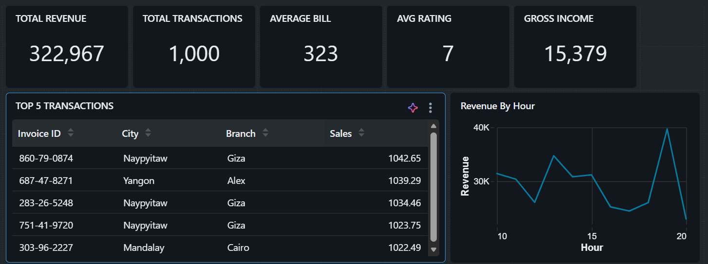
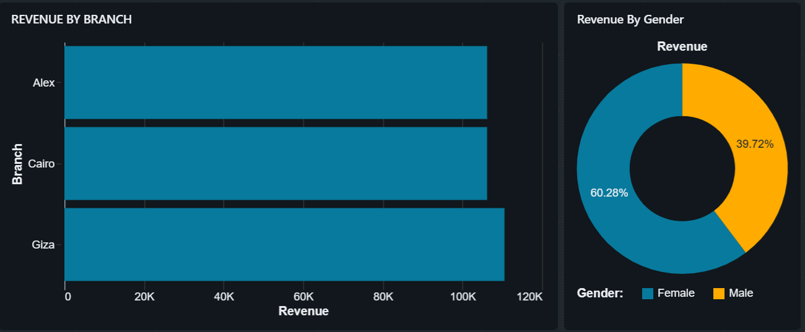
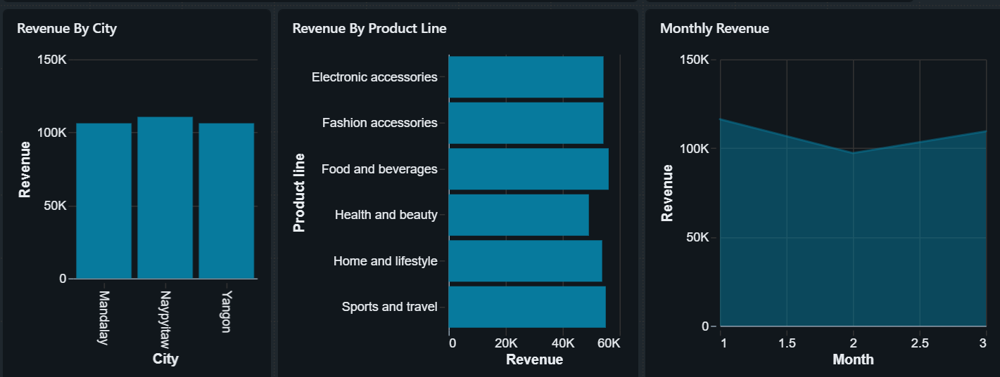
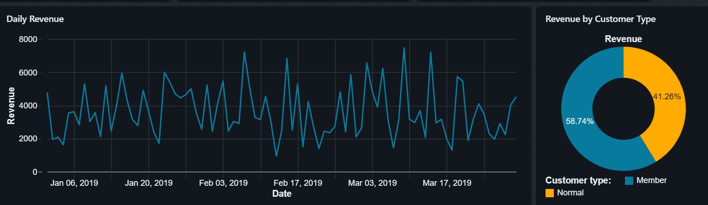
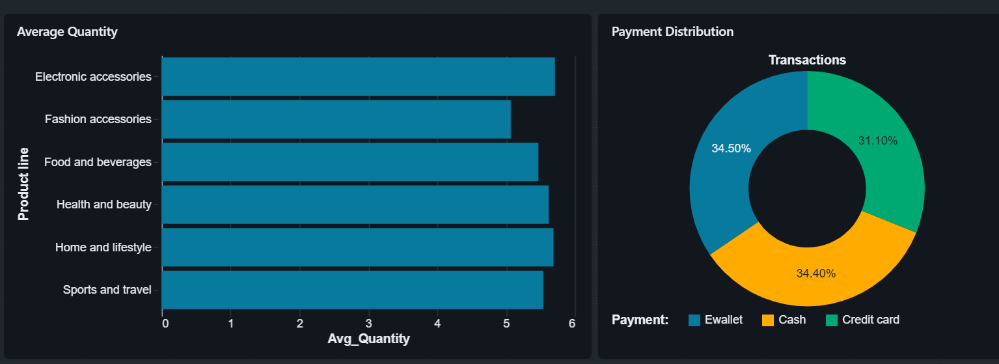

# 🛒 Supermarket Sales Dashboard using Databricks SQL

## 📖 Project Overview

This project demonstrates an end-to-end **Sales Analytics Dashboard** built using **Databricks SQL**. The objective is to analyze supermarket sales transactions and transform raw data into meaningful business insights through SQL queries and interactive dashboards.

The project covers KPI analysis, revenue trends, customer behavior, product performance, and payment analysis to support data-driven business decisions.

---

## 🚀 Technologies Used

- Databricks SQL
- Delta Lake
- SQL Warehouse
- GitHub
- CSV Dataset
- Business Intelligence Dashboard

---

## 📂 Dataset

**Dataset:** Supermarket Sales Dataset

The dataset contains transactional information including:

- Invoice ID
- Branch
- City
- Customer Type
- Gender
- Product Line
- Unit Price
- Quantity
- Sales
- Gross Income
- Payment Method
- Rating
- Date & Time

---

# 📊 Dashboard

## 1️⃣ KPI Dashboard

This dashboard provides an overview of the business through key performance indicators.

**KPIs Included**

- Total Revenue
- Total Transactions
- Average Bill Value
- Average Customer Rating
- Gross Income



---

## 2️⃣ Revenue Analysis Dashboard

Analyzes sales performance across different business dimensions.

**Insights**

- Revenue by Product Line
- Revenue by Branch
- Revenue by City



---

## 3️⃣ Revenue Trend Dashboard

Shows how revenue changes over time.

**Insights**

- Daily Revenue
- Monthly Revenue
- Revenue by Hour



---

## 4️⃣ Customer Analysis Dashboard

Provides insights into customer purchasing patterns.

**Insights**

- Revenue by Customer Type
- Revenue by Gender
- Daily Revenue Trend



---

## 5️⃣ Payment & Quantity Dashboard

Analyzes product quantity sold and preferred payment methods.

**Insights**

- Quantity Sold by Product Line
- Payment Method Distribution



---

# 📈 SQL Analysis

The project includes SQL queries for:

### KPI Analysis

- Total Revenue
- Total Transactions
- Average Bill
- Average Rating
- Gross Income

### Revenue Analysis

- Revenue by Branch
- Revenue by City
- Revenue by Product Line
- Revenue by Hour
- Daily Revenue
- Monthly Revenue

### Customer Analysis

- Revenue by Customer Type
- Revenue by Gender
- Payment Distribution

### Product Analysis

- Average Product Rating
- Average Quantity Sold
- Gross Income by Product Line
- Top 5 Highest Sales Transactions

### Advanced SQL

- Window Functions
- Ranking Functions
- Running Total
- Revenue Share
- ROW_NUMBER()
- RANK()
- DENSE_RANK()

---

# 📁 Repository Structure

```text
supermarket-sales-dashboard-databricks
│
├── Dashboard
│   ├── Dashboard_KPIs.png
│   ├── Dashboard_Revenue.png
│   ├── Dashboard_Revenue2.png
│   ├── Dashboard_daily_revenue-customer_category.png
│   └── Dashboard_Quantity-payment_distribution.png
│
├── Data
│   └── supermarket_sales.csv
│
├── SQL
│   ├── 01_kpi_queries.sql
│   ├── 02_revenue_analysis.sql
│   ├── 03_customer_analysis.sql
│   ├── 04_product_analysis.sql
│   └── 05_operational_analysis.sql
│
└── README.md
```

---

# ▶️ How to Run

1. Upload the supermarket sales dataset into Databricks.
2. Create the table from the CSV dataset.
3. Execute the SQL scripts located in the **SQL** folder.
4. Build visualizations using Databricks SQL.
5. Combine the visualizations into interactive dashboards.

---

# 💼 Skills Demonstrated

- SQL Query Writing
- Business Intelligence
- Dashboard Development
- Data Analysis
- KPI Reporting
- Window Functions
- Data Visualization
- Databricks SQL
- Delta Lake
- Analytical Thinking

---

# 📌 Business Insights

- Identified the highest revenue-generating product lines.
- Compared branch and city-wise sales performance.
- Analyzed customer purchasing behavior.
- Evaluated payment preferences across customers.
- Measured product performance using sales, ratings, and gross income.
- Built interactive dashboards for business reporting.

---

# 👩‍💻 Author

**Karthiha M**

- LinkedIn: https://www.linkedin.com/in/karthihamuthuraj/
  

---
⭐ If you found this project helpful, consider giving it a star!
